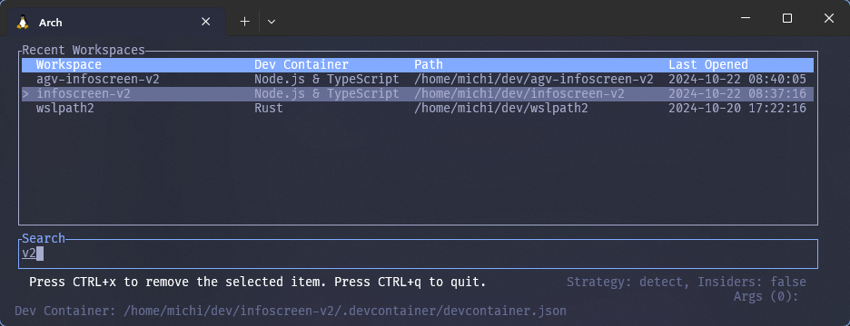

# vscli

[](https://choosealicense.com/licenses/mit/) [](https://github.com/michidk/vscli/actions)

A CLI/TUI which makes it easy to launch [Visual Studio Code](https://code.visualstudio.com/) (vscode) projects, with a focus on [dev containers](https://containers.dev/).



Read [here](https://blog.lohr.dev/launching-dev-containers) about the journey of reverse engineering Microsoft's dev container CLI in order to make this.

## Features

- A shorthand for launching vscode projects (to be used like the `code` command but with dev container support)
- Detects whether a project is a [dev container](https://containers.dev/) project, and launches the dev container instead
- Supports [multiple dev containers](https://github.com/microsoft/vscode-docs/blob/main/remote-release-notes/v1_75.md#folders-with-multiple-devcontainerjson-files) in the same project
- Supports the [insiders](https://code.visualstudio.com/insiders/) version of vscode
- Tracks your projects and allows you to open them using a CLI-based UI

## Installation

[](https://repology.org/project/vscli/versions)

[](https://github.com/michidk/homebrew-tools/blob/main/Formula/vscli.rb)

### [Cargo](https://doc.rust-lang.org/cargo/)

Install [vscli using cargo](https://crates.io/crates/vscli) on Windows or Linux:

```sh
cargo install vscli
```

### [Homebrew](https://brew.sh/)

Install [vscli using homebrew](https://github.com/michidk/homebrew-tools/blob/main/Formula/vscli.rb) on Linux or Mac:

```sh
brew install michidk/tools/vscli
```

### [Chocolatey](https://chocolatey.org/)

Install [vscli using Chocolatey](https://community.chocolatey.org/packages/vscli) on Windows:

```sh
choco install vscli
```

### [Winget](https://learn.microsoft.com/en-us/windows/package-manager/winget/)

Install [vscli using winget](https://github.com/microsoft/winget-pkgs/tree/master/manifests/m/michidk/vscli) on Windows:

```sh
winget install vscli
```

### Additional steps

You can set a shorthand alias for `vscli` in your shell's configuration file:

```sh
alias vs="vscli open"
alias vsr="vscli recent"
```

## Usage

### Commands

After installation, the `vscli` command will be available:

```
Usage: vscli [OPTIONS] <COMMAND>

Commands:
  open    Opens a dev container
  recent  Opens an interactive list of recently used workspaces
  help    Print this message or the help of the given subcommand(s)

Options:
  -s, --history-path <HISTORY_PATH>  Overwrite the default path to the history file [env: HISTORY_PATH=]
  -d, --dry-run                      Whether to launch in dry-run mode (not actually open vscode) [env: DRY_RUN=]
  -v, --verbose...                   More output per occurrence
  -q, --quiet...                     Less output per occurrence
  -h, --help                         Print help
  -V, --version                      Print version
```

#### Open Dev Containers

Opens a dev container.

```
Usage: vscli open [OPTIONS] [PATH] [ARGS]...

Arguments:
  [PATH]     The path of the vscode project to open [default: .]
  [ARGS]...  Additional arguments to pass to vscode [env: ARGS=]

Options:
  -b, --behavior <BEHAVIOR>          Launch behavior [default: detect] [possible values: detect, force-container, force-classic]
  -s, --history-path <HISTORY_PATH>  Overwrite the default path to the history file [env: HISTORY_PATH=]
  -c, --config <CONFIG>              Overwrites the path to the dev container config file [env: CONFIG=]
  -d, --dry-run                      Whether to launch in dry-run mode (not actually open vscode) [env: DRY_RUN=]
  -n, --insiders                     Whether to launch the insider's version of vscode [env: INSIDERS=]
  -v, --verbose...                   More output per occurrence
  -q, --quiet...                     Less output per occurrence
  -h, --help                         Print help (see more with '--help')
```

#### Recent UI

Opens an interactive list of recently used workspaces.

```
Usage: vscli recent [OPTIONS]

Options:
  -s, --history-path <HISTORY_PATH>  Overwrite the default path to the history file [env: HISTORY_PATH=]
  -d, --dry-run                      Whether to launch in dry-run mode (not actually open vscode) [env: DRY_RUN=]
  -v, --verbose...                   More output per occurrence
  -q, --quiet...                     Less output per occurrence
  -h, --help                         Print help
```

The following keybindings are available:

##### Keybindings

| Key/Key Combination             | Action                | Description                            |
| ------------------------------- | --------------------- | -------------------------------------- |
| `Esc`, `Ctrl+Q` or `Ctrl+C`   | Quit                  | Exits the application.
| `Down` or `Ctrl+J`              | Select Next           | Moves to the next selectable item.     |
| `Up` or `Ctrl+K`                | Select Previous       | Moves to the previous selectable item. |
| `KeypadBegin` or `Ctrl+1`       | Select First          | Selects the first item.                |
| `End` or `Ctrl+0`               | Select Last           | Selects the last item.                 |
| `Enter` or `Ctrl+O`             | Open Selected         | Opens the currently selected item.     |
| `Delete`, `Ctrl+R`, or `Ctrl+X` | Delete Selected Entry | Deletes the currently selected item.   |

Note: If an input does not match any of the defined keybindings, it is treated as part of a search input.


##### Launch Behavior

There are three launch behaviors:

- `force-classic`: Launch vscode without a dev container
- `force-container`: Launch vscode with a dev container, error if no dev container is found
- `detect`: Detect whether the project is a dev container project, and launch the dev container if it is

##### Detection Algorithm

The detection algorithm determines which dev container config to launch.

- First, check whether a dev container config was specified via the `--config` flag -> launch it
- Then loads the first dev container it finds
  - If more than one exists -> show a interactive list of dev containers and let the user select one
  - If one exists -> launch it
  - If none exists -> launch vscode normally without a dev container

### Examples

#### Launching a project

You can launch a project using the default behavior:

```sh
vscli open                          # open vscode in the current directory
vscli open .                        # open vscode in the current directory
vscli open /path/to/project         # open vscode in the specified directory
```

The default behavior tries to detect whether the project is a [dev container](https://containers.dev/) project. If it is, it will launch the dev container instead - if not it will launch vscode normally.

You can change the launch behavior using the `--behavior` flag:

```sh
vscli open --behavior force-container .  # force open vscode dev container (even if vscli did not detect a dev container)
vscli open --behavior force-classic .    # force open vscode without a dev container (even if vscli did detect a dev container)
```

When you open a project containing more than one dev container config, you will be prompted to select one:


You can launch the insiders version of vscode using the `--insiders` flag:

```sh
vscli open --insiders .              # open vscode insiders in the current directory
```

Additional arguments can be passed to the `code` executable, by specifying them after `--`:

```sh
vscli open . -- --disable-gpu        # open vscode in the current directory without GPU hardware acceleration
```

Read more about the `code` flags, by executing `code --help`.

#### CLI UI

You can open a CLI-based user interface to display a list of recently opened projects using the `recent` command:

```sh
vscli recent                        # open the CLI-based UI to select a recently opened project to open
```
